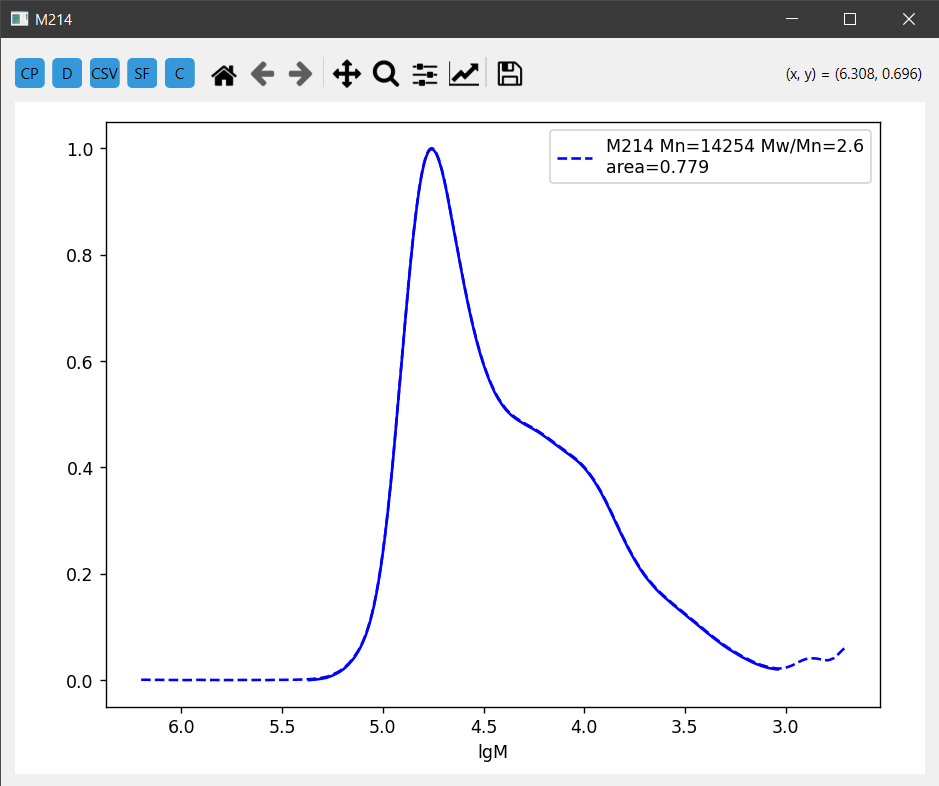

# GPCurve - Chromeleon Peak Analyzer

This program is designed to display and calculate peaks based on files generated by Chromeleon software.

## Installation

1. **Download the program**  
   - Click on `Code` -> `Download ZIP`, then extract the archive.

2. **Install Python 3**  
   - Ensure Python 3 is installed on your system.

3. **Install dependencies**  
   - Run the following command to install all required libraries:
     ```bash
     pip install -r requirements.txt
     ```

4. **Run the program**  
   - Execute the main script:
     ```bash
     python gpcurve.py
     ```

## Usage

1. Place the required files (`xxx.pdf` and `xxx.txt`) in the same folder (see example).
2. Ensure that you have a PDF file containing constants or a folder with such files named in the format `yearmonthdate[RI-or-UV]` (see `constants_example`).

## Screenshots




Enjoy! 😊

