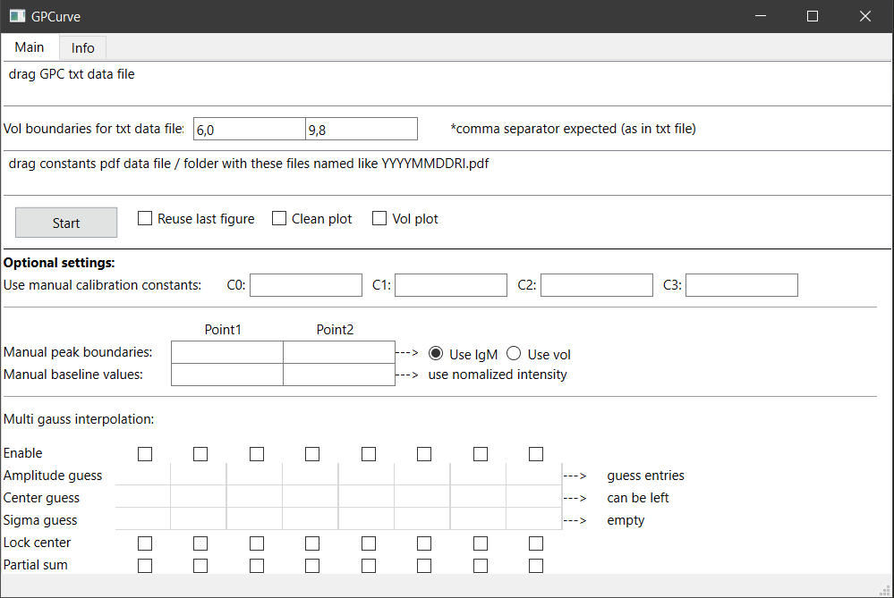
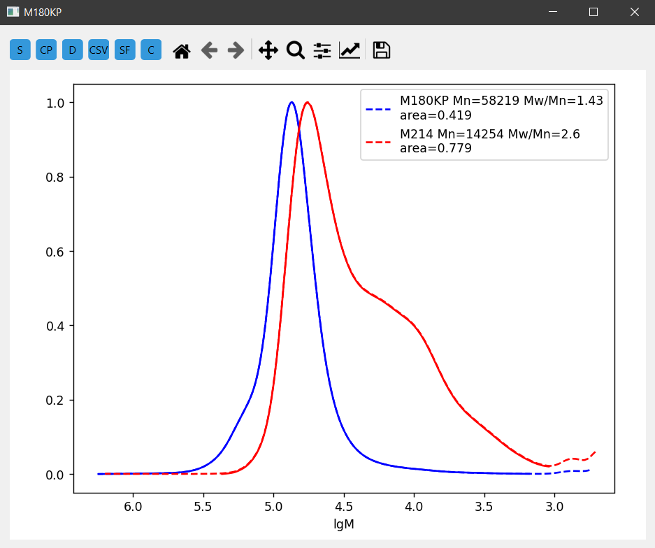
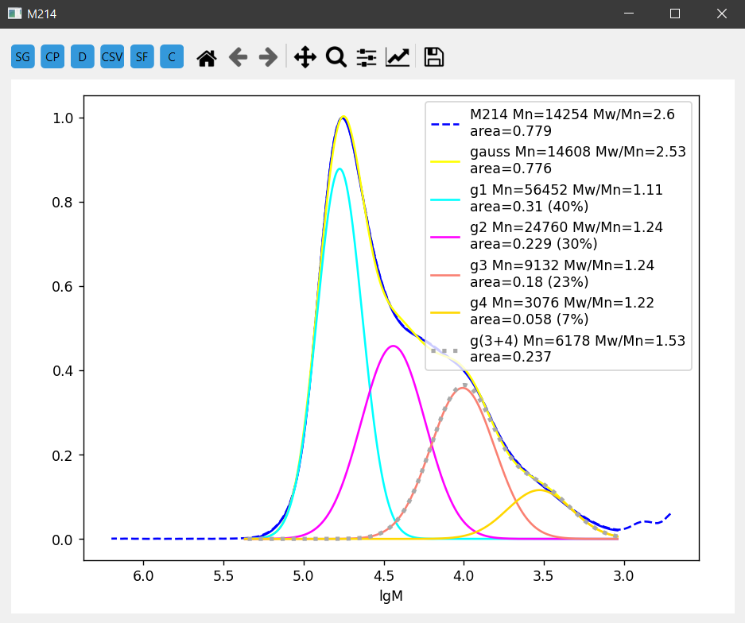

# GPCurve - Chromeleon Peak Analyzer

This program is designed to display and calculate peaks based on files generated by Chromeleon software.

## Binaries (Windows only)

https://drive.google.com/drive/folders/1Btx5mO1TSAfr4CCdPyjc4zwV9LBF7u7H?usp=sharing

The provided prebuilt binaries are for Windows users and do not require Python or dependencies installation.

Simply download and extract the ZIP archive.

## Basic installation

1. **Download the program**  
   - Click on `Code` -> `Download ZIP`, then extract the archive.

2. **Install Python 3**  
   - Ensure Python 3 is installed on your system.

3. **Install dependencies**  
   - Run the following command to install all required libraries:
     ```bash
     pip install -r requirements.txt
     ```

4. **Run the program**  
   - Execute the main script:
     ```bash
     python main.py
     ```

## Compilation

If you want to compile the project into an executable by yourself, follow these steps:

1. Install `pyinstaller` if not already installed:
   ```bash
   pip install pyinstaller
   ```
2. Navigate to the project directory and run:
   - On Windows:
     ```bash
     pyinstaller --noconfirm --windowed --name "GPCurve" --add-data "config.ini;." main.py
     ```
   - On Linux/macOS:
     ```bash
     pyinstaller --noconfirm --windowed --name "GPCurve" --add-data "config.ini:." main.py
     ```
3. The compiled program will be located in the `dist` folder.

## Usage

1. Ensure the data files (`xxx.pdf` and `xxx.txt`) are in the same folder (see example).
2. Ensure that you have a PDF file containing calibration constants or a folder with such files named in the format `yearmonthdate[RI-or-UV]` (see `constants_example`).

## Screenshots








Enjoy! 😊

